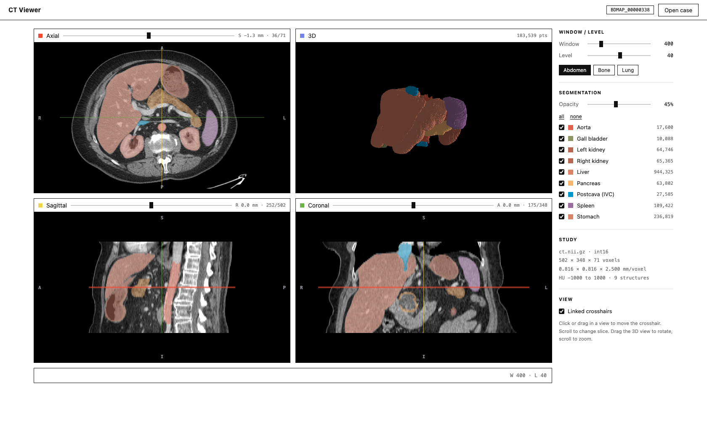

# Browser CT Viewer

A web-based CT scan viewer with per-voxel segmentation overlays, in the spirit of
[3D Slicer](https://www.slicer.org/) but running entirely in the browser. No install,
no server, no GPU — a single self-contained `index.html` with zero dependencies.

Built as the demo for **BodyMaps Developer Project 1** (Johns Hopkins University /
Johns Hopkins Medicine).



## Features

- [x] NIfTI-1 (`.nii.gz`) parsing in pure JavaScript (native `DecompressionStream`, no libraries)
- [x] Drag-and-drop loading (files or a whole folder) with byte-level progress — works even from `file://`
- [x] Window/level controls with radiology presets (Abdomen / Bone / Lung)
- [x] 9 organ segmentation overlays with Slicer's GenericAnatomyColors, per-organ toggles + opacity
- [x] Slicer-style 2×2 layout: axial / sagittal / coronal / 3D, Slicer's viewport color codes
- [x] Linked crosshairs drawn in each intersecting plane's color — click/drag to navigate, scroll to scrub
- [x] Anisotropic voxel aspect correction (0.816 mm in-plane vs 2.5 mm slices)
- [x] Radiological display conventions with R/L, A/P, S/I orientation labels per plane
- [x] Millimetre slice offsets and voxel/HU/organ hover readout
- [x] 3D organ surface view — zero-dependency point-splat renderer with z-buffer,
      lambert shading, drag-to-orbit and scroll-to-zoom
- [x] Case switching without a reload; `?load=sample` deep link for instant demos

## Usage

Open `index.html` in any modern browser and drag the CT + segmentation files in —
or serve the repo with any static file server:

```bash
python3 -m http.server 8000
```

Then visit `http://localhost:8000` — a "Load sample case" button appears
automatically, and `http://localhost:8000/?load=sample` opens straight into the
loaded viewer.

## Data

`data/` contains one abdominal CT scan and 9 per-voxel organ masks
(aorta, gall bladder, kidneys, liver, pancreas, postcava, spleen, stomach) from the
publicly hosted BodyMaps sample `BDMAP_00000338`:

- Volume: 502 × 348 × 71 voxels, int16, spacing 0.816 × 0.816 × 2.5 mm
- CT rescale: `HU = raw × 0.030518 + 0.015259` (from the NIfTI header)
- Masks: binary int8, same grid as the CT

## Architecture

One `index.html`, vanilla HTML/CSS/JS — no frameworks, no build step, no external
requests. See [docs/EXPLAINER.md](docs/EXPLAINER.md) for a full walkthrough of the
pipeline (gunzip → NIfTI header parse → HU rescale → label-volume merge → canvas
slice rendering → z-buffered 3D splatting) and how each stage was verified.

Rendering is CPU-only and measured: ~1.2 ms per 2D slice, ~7 ms for a full
four-view render including the 183k-point 3D view — no GPU required.

Correctness was checked against independent ground truth (a NumPy reimplementation
of the parser: all organ voxel counts and the HU range match exactly) and against
anatomy (liver 1,574 mL, spleen 182 mL — normal adult values; radiological display
conventions verified organ-by-organ).

Requires a browser with `DecompressionStream` (Chrome/Edge 80+, Safari 16.4+,
Firefox 113+). Developed and tested in Chromium.
